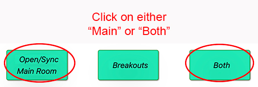
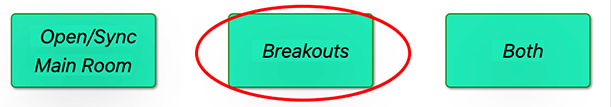
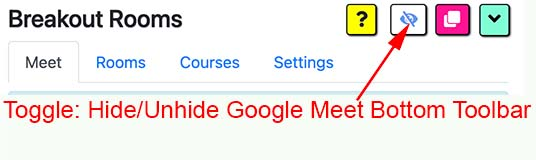

## Breakout Rooms Extension by Robert Hudek

## Online Help

<!-- omit in toc -->

## [Demo Video](https://youtu.be/HY5eZw-gsKU)

## [Step-by-step Video Tutorial](https://youtu.be/mLag62gSUMY)

<!-- ## [Step-by-step Video Tutorial](https://youtu.be/K5ZlfUxVSwc) -->

<!-- ## [Step-by-step Video Tutorial](https://youtu.be/W_XZYIf0fFI) -->

### Setup

- Step 1: [Enter your Courses](#setup-1-enter-your-courses)
- Step 2: [Create Breakout Rooms](#setup-2-create-breakout-rooms)
- Step 3: [Customize your Settings](#setup-3-customize-your-settings)
- Step 4: [Change Google Meet Layout](#setup-4-change-google-meet-layout)
- Step 5: [Confirm Google Account](#setup-5-confirm-google-account)

### Teach Class

- Step 1: [Select course and number of rooms](#teach-class-1-select-course-and-number-of-rooms)
- Step 2: [Start your class](#teach-class-2-start-your-class)
- Step 3A: [Assign breakouts - Ad Hoc](#teach-class-3a-assign-breakouts---ad-hoc)
- Step 3B: [Assign breakouts - Pre Assigned](#teach-class-3b-assign-breakouts---pre-assigned)
- Step 4: [Navigate Rooms and Control Audio Visual](#teach-class-4-navigate-rooms-and-control-audio-visual)
- Step 5: [Broadcast to all breakout rooms](#teach-class-5-broadcast-to-all-breakout-rooms)
- Step 6: [Mute and remove students](#teach-class-6-mute-and-remove-students)

### Utilities

- [Hide / Unhide Google Meet Toolbar](#toggle-hide-unhide-google-meet-toolbar)
- [Re-tile](#re-tile)
- [Minimize/Maximize control panel](#minimizemaximize-control-panel)
- [Reports](#reports)
- [Export / import](#exportimport)

### FAQ

  <!-- omit in toc -->

- [Do my students need to install this extension?](#do-my-students-need-to-install-this-extension)
- [How much memory (RAM) do I need to run the extension?](#how-much-memory-ram-do-i-need-to-run-the-extension)
- [Why can't I see any students in the Assign Participants section?](#why-cant-i-see-any-students-in-the-assign-participants-section)
- [Why can't I see all of my students?](#why-cant-i-see-all-of-my-students)
- [Does this extension work with co-teachers?](#does-this-extension-work-with-co-teachers)
- [What is the Low Memory (RAM) Option?](#what-is-the-low-memory-ram-option)
- [Do students need to leave the main room?](#do-students-need-to-leave-the-main-room)
- [How can I close the breakouts?](#how-can-i-close-the-breakouts)
- [How can I simulate students to practice using the extension?](#how-can-i-simulate-students-to-practice-using-the-extension)
- [Do all the rooms have to be Meets?](#do-all-the-rooms-have-to-be-meets)
- [How can I use this extension on multiple computers?](#how-can-i-use-this-extension-on-multiple-computers)

### Setup 1: Enter your courses

- Breakout Rooms Extension is organized by courses. The first step is to enter your courses in the "Courses" tab.

  

- It is possible to use this extension with just ONE course. You do not need to add multiple courses if you do not want to. If you want to run all your classes through one set of google links which are organized by that one course, you certainly can.
- Multiple courses option is so that teachers may assign certain links to different classes, perhaps on a more permanent basis. Separating them into different courses may make it easier to manage, but it is not a requirement. You can just use ONE course if you want to.
- To highlight the entire contents of an input box, please triple click. This will highlight everything so you can copy/paste or delete.
- To add a row, please click on the green + button
- To save, click on the blue save button
- Please note that all courses must have a unique name
- The red delete button deletes from the bottom up so if you want to delete a course then use drag and drop the move the course to the bottom of the list and then click on the red delete button
- The export/import button which is the far right hand side black button. This will export all of your data from the extension to your pc download folder so that you can import it into a second computer. Or if you want a backup in case you need to uninstall the exension, you can first export the data to your pc so that you can import it after you re-install the extension.

### Setup 2: Create Breakout Rooms

- The breakout rooms are created in the Rooms tab

  

- :smile: **By far the simplest way to use this extension is to leave the "Nickname, Code, URL" link field blank.** Create on the green + button to create your rows of rooms, give each room a unique name and then click on the blue save button. The extension will create the links for you. Most teachers do not use nicknames, codes, or resource URLs. If you want a quickstart and get up and running then just do this: create rows of rooms with unique name, leave the link field blank, and then click on the save button. You're done! Now you have all the rooms you need and can move on to the next step.

  

- **Google Classroom Teachers**: If you are a Google Classroom teacher your Main room link is the same link as the link for your Google Classroom meet.

  **For Google Class teachers only:** Please copy and paste your "Meet link" from your google classroom page as your Main room link in the Rooms tab.

  

  **For Google Class teachers only:** Then go to the Rooms tab of the extension, and copy from your clipboard the meet into the Main room

  

- Types of links:

  - _Nickname_: Nicknames are dynamic because their meet urls change for each session. You may enter any value in the link field as your nickname, but please enter the nickname itself and do not include any prefix such as g.co/meet/ or meet.google.com/lookup/. Nicknames are color coded light green. Nicknames have the advantage that they expire soon after the session concludes with all participants and the teacher exiting the room. In addition, for new sessions the nickname creates new links.

  - _Code_: Codes are static because they always call up the same meet url. A code is a total of 12 characters which consists of the 10 character meet code plus the 2 dashes, in a 3-4-3 format. A code is the 12 characters after the https://meet.google.com/ in the meet url. Static meet urls may be desireable if you want to keep the same link for your sessions

  - _Meet Url_: Meet Urls are static because they always call up the same meet url, however, there is a checkbox setting which can make these dynamic by creating new meet urls "on the fly" each time the room is opened. The meet url is the full https://meet.google.com/abc-defg-hij formatted address. You may leave the field blank if you want the extension to automatically create one for you. There is no need to go to the Calendar

    To make meet urls dynamic you may click the "Automatically create links each time the room is opened" checkbox in the Settings. This checkbox is only relevant for meet urls. The checkbox is ignored for all other categories such as nicknames, codes, and resource urls.

  - _Resource Url_: This may be any web page that the teacher wants to use as a teaching resource, such as a science page, nature website, or a youtube to name a few examples.

### Setup 3: Customize your Settings

- Tabs/Tiles: This controls whether the breakout rooms each have their own window (tiles) or if they are separate tabs in a window (tabs). The tabs option can control the number of tabs within a window
  

- Colors: Customize the bottom border of your Google Meet

- Automatically Allow Outside Participants to enter: This allows participants from outside your organization to automatically enter your room without your approval. If you check this box then if the participant has the link then they can automatically enter the room. This is the equivalent of allowing yourself to be zoom bombed. It is a huge convenience to allow outside participants to enter breakout rooms if they have the link but there is the possibility that an unrecognized person who has this link may enter. The default is Off (not checked). Recommendation is to leave it off to prevent outsiders from entering without your approval.

- Slider and Broadcast Background Images: [Video tutorial]() Choose an URL for an image or leave it blank and just choose a background color ("Back Color"). Font colors can be changed for light and dark background, as well as the position and size of the images

- Automatically Join Meet: [Video tutorial](https://www.youtube.com/watch?v=-AHaEjdP5vg) Only meets whose URL is listed in the rooms tab may be eligible for an automatic join. For "eligible" meets, this automatic join function can be turned on or off by clicking or leaving the checkbox for the Main room and Breakout rooms. All meets with URLs that are not listed in the Rooms tab will not be automatically joined.

- Automatically refresh room links when opened: [Video tutorial](https://www.youtube.com/watch?v=YU7cMYNKrww) If the checkbox is selected then new room links will be created on-demand, whenever the Open button is clicked. This saves the teacher the steps of going to the Rooms tab, blanking out the rooms' links, and clicking save in order to get a fresh set of room links. Now the teacher can choose to have the rooms automatically generate brand new links when the Open room button is clicked.

- There is a checkbox for the Main room and the Breakout rooms, so each category is separately configureable. For example, if the teacher wants to keep the Main room link static but have the Breakout rooms links dynamically refreshed each time, then the teacher can deselect (not check) the Main room checkbox but check the Breakout rooms checkbox.

### Setup 4: Change Google Meet Layout

- For the extension to work properly, you may need to change the setting on your google meet to Tiled Layout

- Click on the 3 dots button at the bottom on the google meet screen and choose "Change Layout"

  

- Click on the radio button for "Tiled" and move the slider all the way to the right to 49.

  

### Setup 5: Confirm Google Account

- Please make sure that your listed primary google account is the account that you use to create google meet links, otherwise your links will not work. You need to be the "owner" of the links in order to open them. The "owner" is the account that you used to create the accounts.

  

- Your primary account is the FIRST account that you used to log in to on your personal computer. If this is not the correct account then please click on the button to reveal the section, then click on the blue button, log out of all your accounts, then log in using your primary google account as the FIRST account you log in, followed by any personal google accounts that you may want to use on this computer.

  

### Teach Class 1: Select course and number of rooms

- On the Meet tab, click on the section "Start Class"

  

- Use the dropdowns for Course and Breakouts to choose your course and desired number of breakout rooms.

  

### Teach Class 2: Start your class

- In the Start Class section you will see three buttons

  

- You may either click on "Main room" button and just open the main room, or click on "Both" to open the main room plus all of the breakout rooms.
- If you first decided to only open the main room, you can always change you mind and open the breakouts later, by clicking on the "Breakouts" button.
- If you click on "Both" while the main room is already open, or while some breakouts are already open, no worries. These rooms will not be opened twice.
- Google Classroom Teachers:
  - If you FIRST open the main room in the extension THEN open the google classroom meet link in your google classroom page, the main room is automatically linked.
  - However, most Google Classroom Teachers first open their google classroom link from their google classroom page by clicking on the "meet link" in the Stream or the icon in their Classwork. That's fine no worries. In this case, when you want to use the breakout extension, please click on the "Main Room" button in this extension to sync the extension with your google classorom page. When you click on the "Main Room" button you should see the tab for the main room to display "Main Room" which indicates everything is synced up correctly.
  - Also as a friendly reminder for GC teachers, in the [setup section step 2](#setup-2-create-breakout-rooms) you will have needed to copy your google classroom link into the Rooms tab as the Main room.
- During class you can change the number of breakout rooms, so please don't worry that you need to decide this ahead of time. If you increase the number of breakout rooms then when you click to open "Breakouts" the extension will only open the breakouts that are not yet open. For example, if you first start out the class with 3 breakouts and later decide to add 2 more, then you may change the number of breakouts to 5 and click Open Breakouts. Just those 2 unopened rooms will be opened.
- :warning: Please do not click on the checkbox "Low Memory Option" unless your computer has a very small amount of memory. If you check this box, then only one breakout room window will be displayed at a time. If you accidentally check this box, no worries. Just uncheck it and then choose your button option: Main, Breakouts, or Both
- :star: To reorganize your tiled windows, after they are opened please click on the red Re-tile button on the top right hand side of the control panel

  

### Teach Class 3a: Assign Breakouts - Ad Hoc

- To assign students on an Ad Hoc basis please click on the button below:

  

- Please make sure that you can see your students in the main room. In this example I only have 6 students.

- Also please remember to set your google layout to Tiled and 49 students, as described in [Change Google Meet Layout](#setup-4-change-google-meet-layout). You only need to do this setup once and google meet will remember this setting. If everything is OK then you should see a list of your students and the "Randomly Assign" button will appear.

  

- Now you may click on the Randomly Assign button to shuffle the students among the groups. You may click the Random button as many times as you wish until you see a reasonable grouping. Also, you may drag and drop students between groups.

  

- Next please click on the button below which will create a popup window.

  

- In this popup window below, click on the first button to copy the Breakout Room Links and then please go to the Main room chat window and paste them in the chat box.
- Click on the second button to copy the Breakout Rooms Assigned Students list and paste them in the chat box.

  

- Paste the two lists (Breakout Rooms Links, and Breakout Rooms Assigned Students) into the chat window below. Google Meet has a 500 character limit on each paste so if the list is long then you may need to divide it up and paste in a couple of chunks.

  

- In this example, my rooms are 1, 2, and 3 so that is why the listing shows 1, 2, 3. If I had room names such as "Apple, Orange, and Banana" then the rooms listings would reflect these names, "Apple: ..., Orange: ..., Banana: ..."

- If you have not already done so, please remember to open the breakout rooms by clicking on the "Breakouts" button below. You may open the breakout rooms early, prior to assignment of students, if you want to.

  

### Teach Class 3b: Assign Breakouts - Pre Assigned

- The instructions for assigning participants in the pre-assigned mode (i.e., from a MS word list you prepared before class) are described in the Meet tab, Assign Participants - Pre Assign section. If you follow those instructions you should be able to see all of your participants, assign then to groups, and copy/paste the links to the students in the Main chat. That section also describes how to trouble shoot if your students do not appear in that section

  

### Teach Class 4: Navigate Rooms and Control Audio Visual

- To move between rooms, please either click on the right or left arrows next to the slider or click on the blank space in the slider bar (the black portion). If you click on a blank space in the slider bar, the yellow dot will immediately move to that position.

  

- When you move between rooms, the slider will automatically do the following muting:

  - In the current room:
    - Turn ON the speaker so the teacher can listen to the students in that room
    - Turn OFF the teacher's microphone to avoid disturbing the breakout discussion. To speak to the students, the teacher may click on that microphone button to toggle it on/off.
    - Turn OFF the teacher's camera to avoid disturbing the breakout discussion. To show the teacher's camera to the students, the teacher may click on that video button to toggle it on/off.
  - In all other rooms:
    - The speaker is turned off.
    - The teacher's microphone is turned off.
    - The teacher's camera is turned off.

- To avoid inconsistencies between the control panel and the individual meet windows, please use the audio visual buttons on the control panel rather than directly clicking the buttons in the individual meet windows. However, If the rooms and the control panel become out of sync, it is easy to get back in sync. Just click on the right arrow and then the left arrow to go right and left, then everything should be back in sync.

- Occasionally if the slider yellow dot on the slider is moved back and forth too quickly then the rooms can temporarily become out of sync. Multiple rooms may have their speaker, microphone, and video on. To get back in sync again, it's simple. Just click on the slider right arrow and then click on the left arrow slider. This will move you right and then left, syncing all the other rooms back to off, off, off for speaker, microphone, and slider.

- I typically move the slider by either clicking on the right and left arrows or by clicking on the slider "blank" spot which will make the slider immediately move to that spot. I have never experienced an out of sync problem using these two methods.

### Teach Class 5: Broadcast to All Breakout Rooms

- Click on the broadcast speaker/microphone/video controls to broadcast into all of the breakout rooms.

  

- Once you click on the slider either left or right, the broadcast will automatically be turned off and the normal mode of listening to the breakout room with muted teacher video and muted teacher microphone.

### Teach Class 6: Mute and Remove Students

- To mute the participants in a selected room, click on the mute button for the corresponding selection.
- To remove participants from a room, click on remove button for the corresponding selection.
- To remove participants and close the room click on the Class Over buttons

  

### Toggle Hide Unhide Google Meet Toolbar

- Sometimes the "real estate" space on your screen is too small, so you can toggle the google meet toolbar to hide or unhide, freeing up space

  

- Click once to hide it, click again to unhide. In this way you can toggle the hide / unhide.

### Re-Tile

- This button will automatically re-tile all of your Google Meet Breakout Rooms windows - your main room and your breakout rooms.

  

- This is super convenient because now you can move windows around, resize them, place one on top of the other and then with a single click on the "Re-Tile" button all the windows will snap back into place, in their original order. Also, teachers may first open the main room and then open the breakouts. With the "Re-tile" button all the windows are tiled together so you can at a glance see all of them. In other cases, during class the teacher may decide to add or close breakouts. With a single click on the "Re-tile" button all the rooms are tiled together.

### Minimize/Maximize Control Panel

- The control panel is the cockpit where the teacher has a large number of features and functions to manage the session. However, the control panel takes up valuable real estate on the screen and can often get in the way. Click on the Minimize/Maximize button to toggle between the full size and minimized size.

  

- Once the rooms are all open then the teacher may minimize the control panel and just use the slider to move between rooms. Please note that ALL of the features of the full-size control panel are still available in the minimized state. All the teacher has to do is scroll down to see the rest of the functions, such as broadcast as one example.

### Reports

> [Click here for video tutorial](https://www.youtube.com/watch?v=WaNBaIAkKUY)

- Click on the "Reports" button in the "Meet" tab to find a list of basic reports. They are copied to the clip board and are downloaded to your computer if the checkbox is checked.

  

### Export/Import

> [Click here for video tutorial](https://www.youtube.com/watch?v=GtCh2Mrx6Rk)

- There are export/import of breakout room within the "Rooms" tab.

  

- **Most common usage:** To copy the entire project, all of the courses and all of the breakout rooms, choose the export/import option within the "Courses" tab. Teachers export the extension file data in order to back it up in the event needing to uninstall / re-install the extension or to copy the breakout room extension data to another one of their computers.

  

- The export file is a very small text file which contains the breakout rooms links, courses, and settings. It will be downloaded into your pc's download folder.

  

### Do my students need to install this extension?

- No. Only the teacher needs to install the extension.
- There are some functions on the extension that the students may like for their personal use such as the addition of the Speaker button and some color themes, however, students do NOT need to install the extension.

### How much memory (RAM) do I need to run the extension?

- Normal Mode: In the "normal" mode where you open up all the breakouts simultaneously in either tab or tile mode, most teachers report that they need about 16G RAM to open more than a few rooms, such as 10. In the normal mode, please do NOT check the checkbox in the Meet tab, Sart Class section.

- Low Memory (RAM) Mode: Video Demo In the "low memory mode" mode even a tiny computer such as a chromebook should be able to run and manage a very large number of breakouts, such as 50. Theoretically it is unlimited because only one breakout room is displayed on your computer at a time. Even though all the rooms are "open", your computer will display them one by one using the slider control For additional help on this option please click on the red Help in the checkbox text.

### Why can't I see any students in the Assign Participants section?

- The main reason you cannot see any students in the Assign Participants section is likely because your display of Google Meet does not have any students in it. The students icons need to be visible in the meet window in order for the extension to see them to put them in the assign participants section.

- If you are a Google Classroom teacher please make sure your Google Classroom meet is in sync with the Main room, by ensuring that the link is your Main room in the Rooms tab and you clicked on the open Main Room button to sync it up.

- Please remember that if a link was created by another user, or by yourself but under a different google account name, then you may not be able to open that link. Google by default uses the Primary Account to open the meet links. The primary account is the FIRST account that you use to login to your computer with. You can view this primary account in the Rooms tab and also in the Meet tab. If it is not your correct account then unfortunately you will need to log out of all your google accounts and then re-log in keeping in mind your first login is your primary account (school account).

### Why can't I see all of my students?

- It is likely because your display is not tiled and not set to 49. Please click on the triple dot button on the bottom of your google meet and then select "Change Layout", then click on the radio button for the "Tiled" format, then click on the slider in that popup to push it to 49. Now you can view 49 students in a tiled format on the screen which should be plenty large enough for assigning participants.

### Does this extension work with co-teachers?

- Yes it does. Here is a video that explains how you can use this extension in a teaching environment
  [co-teachers](https://youtu.be/6Z_b4aWHrvY)

### What is the Low Memory (RAM) option?

- This option is not commonly used. The normal mode is to not check this box, leave it unchecked.

- If your computer lags significantly (or freezes up) when you open multiple breakout rooms it may be because your computer's RAM memory is 8G RAM or less. If this is the case, then consider clicking on the "Low Memory (RAM) Option" where you will have only 1 breakout room window visible at a time.

- With this option you still can create and manage a large number of breakout rooms but in order to save memory only one breakout room window is opened at a time. Theoretically, you can use this method to manage 100 or more breakout rooms on just a tiny memory chromebook, however, you may only see one breakout room at a time similar to Zoom where the teacher can only see one breakout room at a time.

- The one difference in the process is that you will need to cycle through all of your rooms (lets say 20 as an example) first in order for those students to enter. Unless you check "on" the auto allow students (outside participants) to enter checkbox in the settings sections, google meet will require you as the teacher to be in the room for students to enter. However, once they have entered then you can leave the room and go to the next one.

- In order to make this process go quicker, if you choose this low memory option first ask the students to enter their rooms. They will see a message that they are waiting for you to enter the room. Now you can cycle through your rooms, 20 rooms in this example, to allow them to enter. Once you complete this cycle, then everything works normally. You can enter any room you want to monitor their progress.

- With this option there is no broadcast because you as the teacher are only present in one room at a time.

### Do students need to leave the main room?

- No you can allow them to stay in the main room, just make sure they mute themselves so they do not disturb themselves or others when they concurrently have both the Main room and their Breakout room open.

- Students on mobile devices will have to leave the Main room to enter their Breakout room because Google Meet does not allow mobile users to concurrently be in multiple meets at the same time.

### How can I close the breakouts?

- You may close the breakouts through the extension control panel in the "Mute and Remove Participants" section or just directly close the meets.

### How can I simulate students to practice using the extension?

- If you have a Google suite account then you can create simulated students by using Chrome incognito and enter any name you choose. If you do not have a Google suite account then you will need to use (extra) Google accounts to simulate students

### Do all the rooms have to be Meets?

- No. You can also include urls for Youtube and other web site resources in your Rooms list. Think of it as staging your resources and then calling them up when you need them as if they are a "room", all neatly tiled on your screen.

### How can I use this extension on multiple computers?

- Use the export/import option in the "Courses" tab to download your data from your first computer. Go to your second computer and import this file. Now the two computers are in sync
